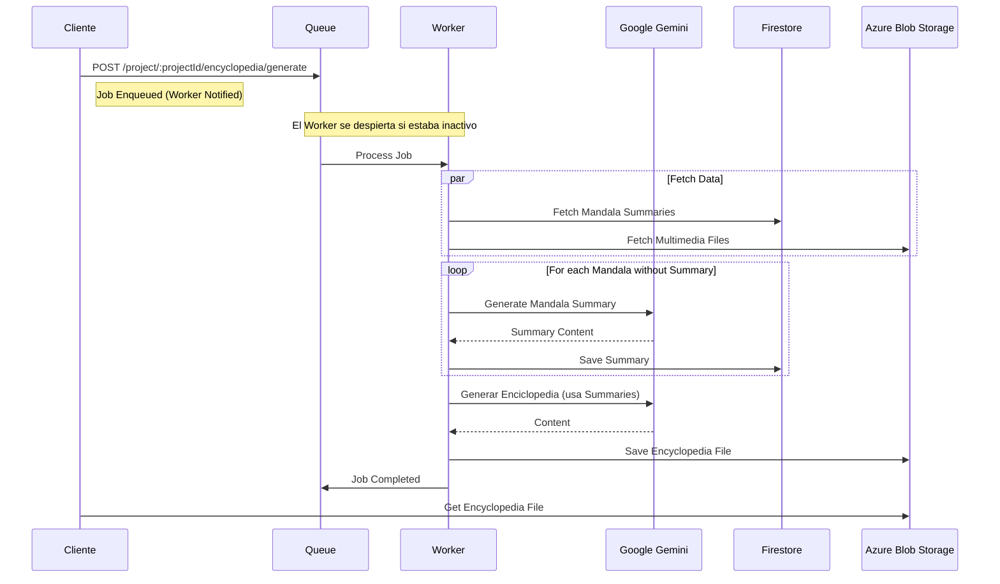
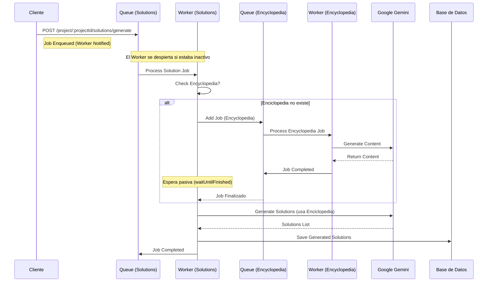

# Arquitectura del Sistema

Este documento detalla las decisiones de diseño, flujos de datos y componentes internos del backend de Austral Worldbuilding Lab.

## 1. Iteración de Mundos

El concepto de **Iteración de Mundos** permite crear versiones alternativas o evoluciones de un proyecto existente sin perder el estado original. Esto es fundamental para explorar "what-if scenarios" en el worldbuilding.

### Estructura Jerárquica
La base de datos modela esto mediante una relación recursiva en la entidad `Project`:

- **`parentProjectId`**: Referencia al mundo del cual se derivó la iteración actual.
- **`rootProjectId`**: Identifica el proyecto original (la raíz del árbol de iteraciones).
- **`children`**: Permite navegar hacia las iteraciones derivadas.

### Visualización
El frontend utiliza esta estructura para mostrar un árbol de decisiones o línea de tiempo, permitiendo al usuario navegar entre distintas versiones del mundo.

> El diagrama muestra cómo un proyecto "Raíz" puede ramificarse en múltiples iteraciones, creando un árbol de historias paralelas. Cada iteracion toma como input la enciclopedia generada por la iteracion anterior, asi puede mantener el contexto del mundo original y evolucionar en nuevas direcciones.

---

## 2. Sistema de Invitaciones

El sistema maneja dos niveles de acceso mediante invitaciones, permitiendo una granularidad fina en los permisos de colaboración.

### Niveles de Invitación
1. **Organización (`OrganizationInvitation`)**:
   - Otorga acceso a **todos** los proyectos dentro de una organización.
   - Ideal para equipos estables o administradores.
   - Gestionado por la entidad `OrganizationInvitation`.

2. **Proyecto (`Invitation`)**:
   - Otorga acceso a un **único proyecto** específico.
   - Útil para colaboradores externos o invitados temporales.
   - Gestionado por la entidad `Invitation`.

### Flujo de Invitación
1. **Creación**: Un usuario con roles de `dueño` o `facilitador` genera una invitación ingresando un email.
2. **Token**: Se genera un token único y se envía por correo (si SMTP está configurado) o se genera un link para compartir.
3. **Aceptación**:
   - Si el usuario **ya existe**, la invitación se asocia a su cuenta y se le asigna el rol correspondiente (`UserProjectRole` o `UserOrganizationRole`).
   - Si el usuario **no existe**, se le redirige al registro, y tras crear su cuenta, se procesan las invitaciones pendientes asociadas a su email.

---

## 3. Arquitectura de Soluciones y Workers

La funcionalidad de generación de soluciones utiliza el contenido de la enciclopedia del proyecto para plantear soluciones, sobre las cuales luego se pueden generar action items e imagenes concretas de esa solución. Dado que este proceso implica mayor complejidad y tiempo de respuesta, se diseñó una arquitectura asíncrona robusta.

### Flujo de Trabajo
1. **Request & Queue**: Cuando el usuario solicita soluciones, el trabajo no se procesa al instante, sino que se encola en **BullMQ**.
2. **Context Awareness**: El sistema verifica la existencia de una enciclopedia actualizada. Si no existe, se genera primero como paso previo.
3. **AI Generation**: Se utiliza Gemini para "razonar" sobre los problemas del proyecto y plantear soluciones concretas.

### Uso Estratégico de Redis
Esta es la **única parte del sistema que utiliza Redis** intensivamente, y la decisión de arquitectura responde a necesidades específicas:
- **Robustez y Pipeline**: Permite soportar una pipeline de trabajos (Soluciones -> Enciclopedia -> IA). Si un paso falla (ej. timeout de la API de IA), el sistema tiene un mecanismo de **fallback y retry automático** (backoff exponencial).
- **Escalabilidad**: Prepara al sistema para soportar múltiples requests de generación simultáneos en el futuro sin bloquear el thread principal de Node.js.
- **Gestión de Latencia**: Como generar soluciones tarda mucho tiempo, desacoplar el proceso en workers evita problemas de timeout en el frontend.

### Diagramas de Flujo

#### Generación de Enciclopedia
Este es el flujo base. La enciclopedia actúa como una capa de síntesis que resume todo el contenido del proyecto para proveer contexto a la IA. Está pensada específicamente para resaltar el **Contexto del Mundo**, **Personajes y Perspectivas**, **Dimensiones y Escalas**, **Patrones y Tendencias**, e **Insights y Oportunidades**. Esto optimiza su posterior uso para la generación de soluciones al eliminar ruido innecesario y enfocar al modelo en lo que realmente importa.

#### Generación de Soluciones (con Dependencia)
La generación de soluciones es más compleja porque **depende** de que exista una enciclopedia. Si no existe, el worker de soluciones puede disparar un job de enciclopedia y esperar a que termine.

### Componentes de Queue
El sistema utiliza dos colas principales gestionadas por servicios específicos que extienden la lógica de "On-Demand":
- `SolutionsQueueService` (`src/modules/queue/services/solutions-queue.service.ts`)
- `EncyclopediaQueueService` (`src/modules/queue/services/encyclopedia-queue.service.ts`)

Ambos servicios registran sus propios procesadores y gestionan el ciclo de vida de los workers para que solo consuman recursos cuando hay trabajos activos.

### Workers On-Demand
Para optimizar el uso de recursos y minimizar costos (especialmente requests a servicios gestionados de Redis como Upstash):
- **On-Demand**: Los workers **no están encendidos 24/7**. Se inician automáticamente solo cuando se detectan trabajos en la cola y se apagan automáticamente cuando quedan inactivos.
- **Configuración Flexible**: Aunque ahora funcionan bajo demanda, el sistema está preparado para cambiar a un modelo "always-on" con un **cambio de configuración menor**.

---

## 4. Arquitectura de Inteligencia Artificial

El módulo de IA es el núcleo funcional del laboratorio y está diseñado para ser agnóstico, extensible y eficiente en el manejo de contextos masivos.

### Patrones de Diseño
Para garantizar la mantenibilidad y escalabilidad del código de IA, se implementaron los siguientes patrones:

1.  **Adapter Pattern**:
    *   **Propósito**: Desacoplar la lógica de negocio del proveedor de IA específico.
    *   **Implementación**: `AiAdapterUtilsService` y `GeminiAdapter`.
    *   **Beneficio**: Permite cambiar el modelo subyacente (ej. de Gemini a GPT-4 o Claude) sin modificar el resto del sistema, simplemente creando un nuevo adaptador.

2.  **Strategy Pattern**:
    *   **Propósito**: Encapsular algoritmos de generación específicos para cada tipo de contenido.
    *   **Implementación**: Directorio `src/modules/ai/strategies/`. Cada tipo de generación (Soluciones, Enciclopedia, Preguntas, Imágenes) tiene su propia estrategia aislada.
    *   **Beneficio**: Facilita agregar nuevas capacidades de generación (ej. "Generar Guión de Video") sin tocar el código existente, solo registrando una nueva estrategia.

3.  **Composite Pattern (Prompt Builder)**:
    *   **Propósito**: Construir prompts complejos de manera modular y reutilizable.
    *   **Implementación**: `AiPromptBuilderService`.
    *   **Beneficio**: Los prompts no son strings monolíticos; se componen dinámicamente combinando:
        *   **Instrucciones del Ciclo** (ej. "Ciclo 1: Divergencia", "Ciclo 3: Convergencia").
        *   **Variables de Contexto** (Timeline de provocaciones, descripciones).
        *   **Tarea Específica** (Prompt base).

### Elección Tecnológica: Google Gemini
La decisión de utilizar **Google Gemini** como motor principal se basa en ventajas críticas para el worldbuilding:

*   **Long Context Window**: El worldbuilding genera volúmenes masivos de texto. Gemini permite inyectar **todo el contexto del proyecto y la enciclopedia** en una sola ventana de contexto (hasta 1M+ tokens), eliminando la necesidad de implementar sistemas complejos de RAG (Retrieval-Augmented Generation) manual que a menudo pierden matices narrativos.
*   **Files API & Multimedia Nativo**: A diferencia de otros modelos que requieren convertir imágenes a Base64 (aumentando el tamaño del payload y complejidad), Gemini posee una **Files API** nativa. Esto permite subir archivos multimedia (mapas, referencias visuales) directamente y referenciarlos en el prompt, agilizando drásticamente la iteración y el análisis multimodal.
*   **Velocidad de Iteración**: La combinación de contexto largo y manejo nativo de archivos permite un ciclo de desarrollo mucho más rápido y menos propenso a errores de truncado de datos.
